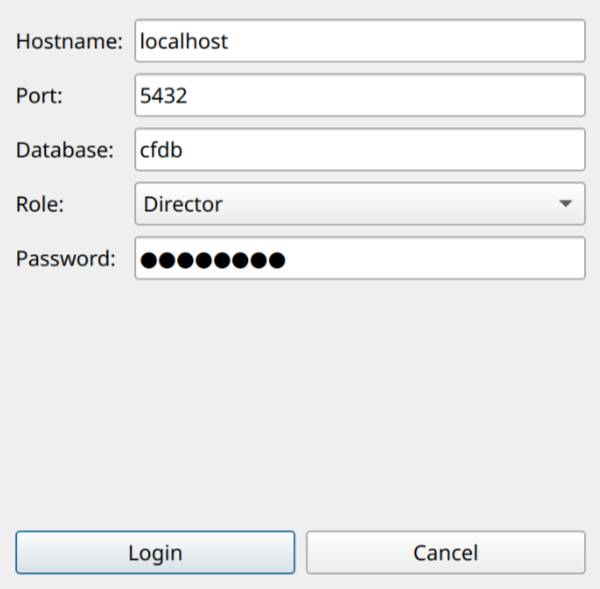
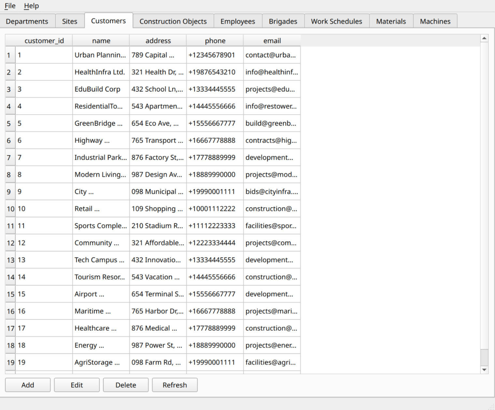
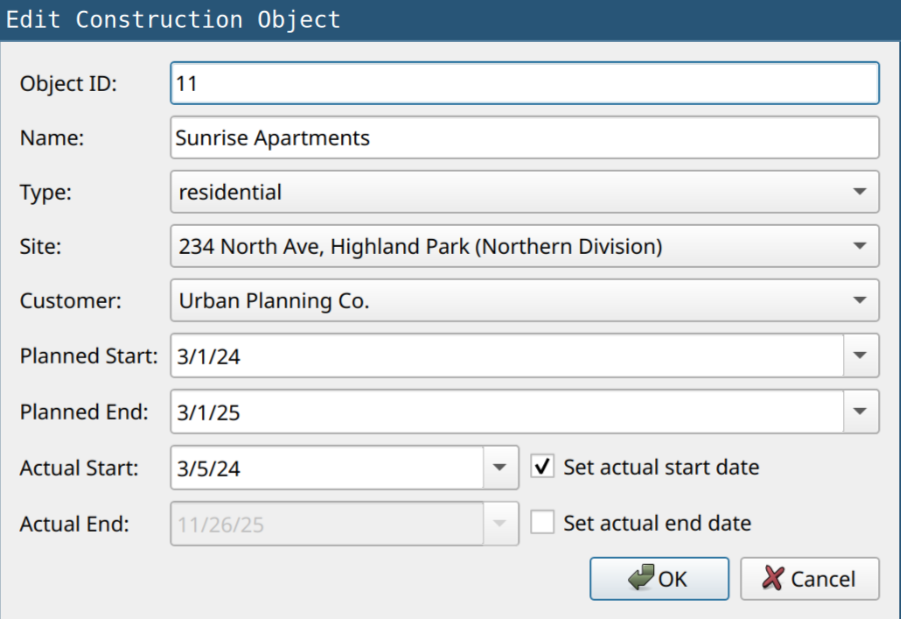

### Приложение-клиент для управления базой данных

Для управления данными в БД реализовано приложение на C++ Qt. Приложение позволяет подключиться к базе данных под соответствующей ролью (director, hr_manager, project_manager). Пароль в целях тестирования указывается автоматически. Есть возможность просматривать, изменять, удалять и добавлять данные в таблицах.

Экран подключения к БД:\
\
Главный экран:\
\
Экран редактирования:\

